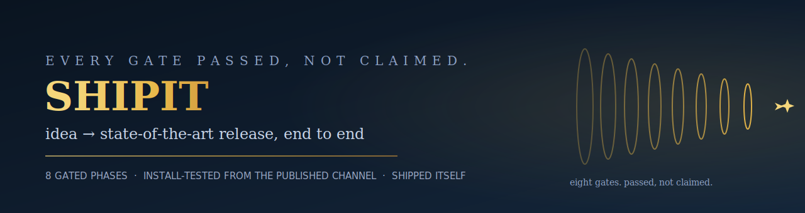
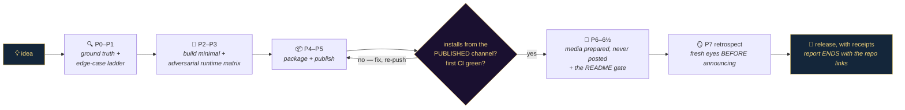

<div align="center">



[](https://github.com/fire17/shipit/actions/workflows/ci.yml)
[](https://github.com/fire17/shipit/releases)
[](#-the-eight-phases-each-with-a-gate)
[](tests/run.sh)
[](#-lineage--distilled-from-a-real-ship-then-shipped-itself)
[](LICENSE)
[](https://github.com/fire17/shipit/stargazers)

### *A release you didn't install-test is a claim, not a release.*

**[⚡ Install](#-install-30-seconds)** · **[🚦 The phases](#-the-eight-phases-each-with-a-gate)** · **[🧬 Lineage](#-lineage--distilled-from-a-real-ship-then-shipped-itself)** · **[🛡 Safety](#-safety-design)**

</div>

---

## 🤯 The part that should stop you: the playbook shipped itself

A [Claude Code skill](https://docs.anthropic.com/en/docs/claude-code) that takes a project from idea to state-of-the-art release — designed against edge cases, tested across runtimes, packaged, published, with launch media prepared. Alias: `/sota`. This is what a run looks like:

```console
$ claude
> /shipit a better cd

  Phase 0  ground truth      gh auth ✓ · name free ✓ · user's shell paradigm read
  Phase 1  edge-case ladder  compose-never-clobber · destructive-safe undo · tty-guarded
  Phase 2  build minimal     one file · zero deps · hot path measured (~25µs)
  Phase 3  verify            67 assertions × bash+zsh+dash · stubbed externals · live run
  Phase 4  package           README · CI · installer with backups + markers
  Phase 5  publish           repo + release + brew tap — install-tested from the channel
  Phase 6  media             Show HN + X thread prepared, never auto-posted
  Phase 7  retrospect        fresh-eyes run BEFORE announcing → v0.1.1 wart fix
```

**That transcript is real** — and so is the lineage:

- The skill is **distilled from an actual ship**: [bettercd](https://github.com/fire17/bettercd) v0.1.0→v0.1.1, released in one session. Every rule in the playbook is a lesson that actually burned during that release (or one since).
- Its **first fresh run was shipping itself** — the repo you're reading is the skill's own output, gates and all.
- Every phase ends in something *observable*: a green runtime matrix, an install that worked from the published channel, a fresh-eyes run in the retrospect window. The core creed:

> **Verify by running the real thing from the published channel** — a release you didn't install-test is a claim, not a release.

- It keeps growing the only way it's allowed to: **from real failures**. v0.3.0 added the close-with-the-links law after a run ended without printing where the work lived; v0.4.0 added the [`/awesome-readme`](https://github.com/fire17/awesome-readme) gate the day that skill was born.



> [!IMPORTANT]
> **The one-line pitch:** the difference between "I pushed it" and "I shipped it" is eight gates — this skill makes Claude pass them, not claim them.

---

## ⚡ Install (30 seconds)

**One-liner** (inspect [install.sh](install.sh) first if you like — it backs up anything it would overwrite and never clobbers a foreign skill):

```sh
curl -fsSL https://raw.githubusercontent.com/fire17/shipit/main/install.sh | sh
```

**From a clone** (contributors: `--link` makes your skills dir track the checkout):

```sh
git clone https://github.com/fire17/shipit && sh shipit/install.sh          # copy
sh shipit/install.sh --link                                                 # symlink
```

Restart your Claude Code session (skills load at start), then:

```
/shipit <project idea or path>     — or —     /sota <...>
```

Uninstall: `sh install.sh --uninstall` (removes only what it owns; backups are kept).

---

## 🚦 The eight phases, each with a gate

A `SKILL.md` playbook Claude loads and executes — eight ordered phases, each ending in a gate you must *pass, not claim*:

| # | Phase | The gate |
|---|---|---|
| 0 | [Ground truth first](SKILL.md#phase-0--ground-truth-first) | auth verified, name collisions checked, the user's existing paradigm read |
| 1 | [Design against the failure modes](SKILL.md#phase-1--design-against-the-failure-modes) | the edge-case ladder written *before* code — typo / script / undo / clobber |
| 2 | [Build minimal](SKILL.md#phase-2--build-minimal) | single file if possible, zero deps, hot path *measured* |
| 3 | [Verify like an adversary](SKILL.md#phase-3--verify-like-an-adversary) | dependency-free harness green across the runtime *matrix*, honest counters |
| 4 | [Package](SKILL.md#phase-4--package) | README leads with the outcome; LICENSE, CHANGELOG, CI, backing-up installer |
| 5 | [Publish](SKILL.md#phase-5--publish-each-step-verified) | **installed from the published channel; first CI run watched to green** |
| 6 | [Media](SKILL.md#phase-6--media-prepare-never-auto-post) | Show HN + X thread prepared — posting stays the human's call |
| 6½ | [The README gate](SKILL.md#phase-6--the-readme-gate-awesome-readme--mandatory-last-polish-gate) | [`/awesome-readme`](https://github.com/fire17/awesome-readme)'s 13 elements + live battery, before true completion |
| 7 | [Retrospect BEFORE announcing](SKILL.md#phase-7--retrospect-before-announcing) | a fresh-eyes run in the released-but-unannounced window catches the wart |

Plus [update-run discipline](SKILL.md#update-runs--re-shipping-an-already-published-project) (fetch-first, version-bump all surfaces, re-gate) and the [anti-patterns list](SKILL.md#anti-patterns-each-one-burned-someone) — each one burned someone. Portability bugs live in the deltas between shells and runtimes (real example: zsh's `command cd` runs the external no-op `/usr/bin/cd` — every zsh test failed until delegates used `builtin`), which is why the matrix is a gate, not a suggestion.

<details>
<summary><b>❓ FAQ — the skeptic's three questions</b></summary>

**Is this just a checklist?** It's a playbook with *gates* — the difference is each phase ends in something observable (a green matrix, a successful install from the published channel, a fresh-eyes run). Claude executes it; the phases keep it honest.

**Why phases instead of "just be careful"?** Because every anti-pattern in the skill's final section burned someone during a real release. Encoding the lesson beats remembering it.

**Does it work for things that aren't shell tools?** Yes — the phases are language-agnostic (the verify matrix becomes node LTS versions, python versions, etc.). For non-binary artifacts, the curl installer / git clone *is* the package channel.

</details>

---

## 🧬 Lineage — distilled from a real ship, then shipped itself

| When | What happened | The law it produced |
|---|---|---|
| 2026-07-06 | [bettercd](https://github.com/fire17/bettercd) shipped v0.1.0→v0.1.1; the retrospect window caught a false-positive doctor warning before any post went out | the whole playbook, distilled the same day |
| v0.1.0 | shipit ships **itself** as its first fresh run | eating your own gates is the credibility gate |
| v0.2.0 | first day in production (bettercd, claude-queue, my-skills, /sas) | **update runs**: fetch-first, version-bump all surfaces, honest counters |
| v0.3.0 | a run ended without printing where the work lives; the human had to ask | **close with the links** — every run ends with every repo created & updated |
| v0.4.0 | [`/awesome-readme`](https://github.com/fire17/awesome-readme) born from a README overhaul (and a guessed GitHub anchor that 404'd) | **Phase 6½** — the README gate, mandatory before true completion |

Since then it has been the release engine behind [`fable-a-fable`](https://github.com/fire17/fable-a-fable), [`fable-masterclass`](https://github.com/fire17/fable-masterclass), [`save-and-ship`](https://github.com/fire17/save-and-ship) (which chains into it), and [`awesome-readme`](https://github.com/fire17/awesome-readme). **Defects its own process caught, publicly:** the bettercd doctor wart (fresh-eyes window) · committed Python bytecode in save-and-ship (retrospect window) · a lint gate misreporting shellcheck as absent (fixed same run) · the guessed anchor that founded the README gate.

---

## 🛡 Safety design

| Concern | Behavior |
|---|---|
| Existing `shipit` skill with local edits | backed up to `SKILL.md.bak.<ts>` before overwrite; identical content → no churn |
| You already have a `sota` skill | left untouched, warned (compose, never clobber) |
| Scripts / CI | no prompts anywhere; `set -e`; deterministic |
| Undo | `--uninstall` removes only owned files; exact undo commands printed at install |
| Custom skills dir | `SHIPIT_SKILLS_DIR` env override |

---

## 🔬 Verification

[`tests/run.sh`](tests/run.sh) — 25 assertions (skill structure incl. all 8 phases, copy/link/uninstall modes, idempotency, backup-on-divergence, foreign-skill preservation) under bash, zsh, and dash; shellcheck-clean; CI on ubuntu + macos.

---

## 🌟 Star it the way it would star itself

This playbook only believes what it watched happen — so don't star the pitch, star the receipts: the gates above are all public, the lineage table names its own failures, and the repo is its own first fresh ship. **If one of its anti-patterns ever burned you differently, [open an issue](https://github.com/fire17/shipit/issues)** — that's the only way new rules get in.

<div align="center">

[](https://star-history.com/#fire17/shipit&Date)

**Siblings:** [`save-and-ship`](https://github.com/fire17/save-and-ship) (checkpoint → chains into shipit) · [`awesome-readme`](https://github.com/fire17/awesome-readme) (Phase 6½) · [`bettercd`](https://github.com/fire17/bettercd) (the ship it was distilled from) · [`fable-masterclass`](https://github.com/fire17/fable-masterclass)

</div>

---

## 📄 License

[MIT](LICENSE) © [fire17](https://github.com/fire17)

<div align="center">
<sub><i>Passed, not claimed.</i></sub>
</div>
